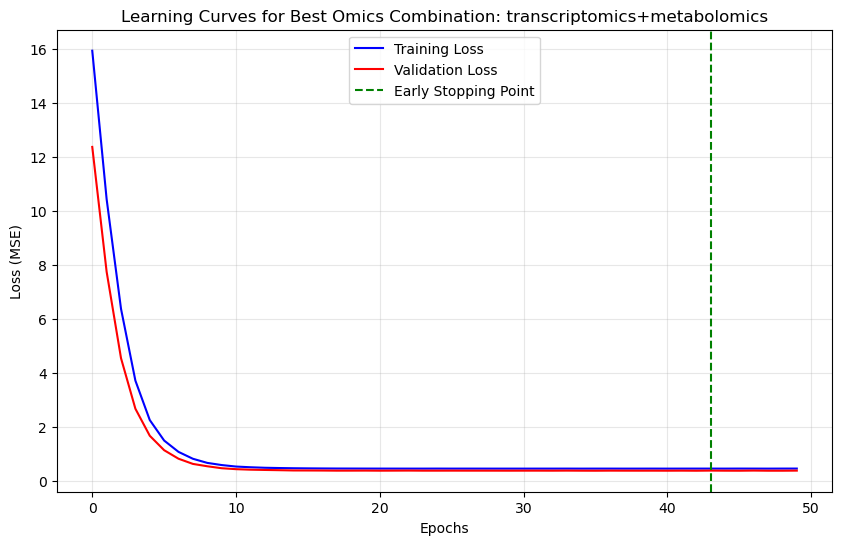
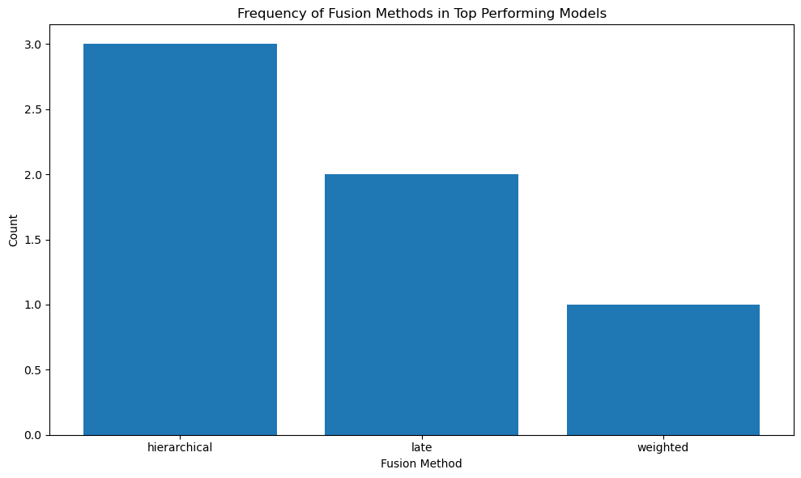

<!--
-*- coding: utf-8 -*-

 Author: Jantine Broek <jantine.broek@simmons-simmons.com>
 License: MIT
-->

# Multi-Omics Transformer


## Table of Contents
1. [General Info](#general-info)
2. [Model and Data](#model-and-data)
3. [Build and Run](#build-and-run)
4. [Model Performance](#model-performance)
5. [License](#license)


<a name="general-info"></a>
## General Info

This repository contains a project for predictive modelling of proteomics data using a Multi-Omics Transformer architecture. The goal is to predict proteomics data using multi-omics data (transcriptomics, methylation, metabolomics, cnv) as input. The project compares a baseline MLP model with the Multi-Omic Transformer models to evaluate their performance and suitability for this task.


### Repository Structure

```
.
├── datasets/                           # Input data files
├── models/                             # Model files (.pth)
├── notebooks/                          # Data analysis, training/eval, etc
├── results/                            # Prediction results
├── transformer_multiomics              # Core project code
└── README.md, etc                          
```


<a name="model-and-data"></a>
## Model and Data

### Task Type and Model Decision
This task is a regression task, where one type of omics data is predicted using others. Both VAEs and Transformers are suitable choices: VAEs excel with noisy data and handle missing values well, while Transformers are powerful for capturing complex interactions between features through their self-attention mechanism.

I selected a Transformer model because the multi-head attention can learn different types of relationships between omics data features and capturing various correlations that might exist. The self-attention mechanism allows the model to identify important feature interactions, which I think are important in multi-omics data integration. While VAEs would also be suitable, particularly for handling noise and missing values, the potential complex interactions between omics data features made Transformers my preferred choice.

### Data
The aim is to use multiple input omics datasets to predict proteomics data. Input omics data was selected by iteratively testing combinations to determine which best predicted proteomics. This indicated that transcriptomics data only as the optimal input combination for proteomics prediction.


<a name="build-and-run"></a>
## Build and Run

### How to Build

This repository uses Git Large File Storage (Git LFS) to handle the large `.pth` model files. To clone and use this repository:

1. Install Git LFS if you haven't already:
   ```bash
   # For Ubuntu/Debian
   apt-get install git-lfs

   # For macOS with Homebrew
   brew install git-lfs

   # For Windows with Chocolatey
   choco install git-lfs
   ```

2. Enable Git LFS:
   ```bash
   git lfs install
   ```

3. Ensure you have Python 3.8 or higher installed.
4. Clone the repository:
   ```bash
    git clone https://github.com/Jan10e/transformer_multiomics.git
    cd transformer_multiomics
   ```

5. Pull the LFS files:
   ```bash
   git lfs pull
   ```

6. Create a (conda) environment. For example:

    ```bash
    conda create -n transformer_multiomics python=3.11
    conda activate transformer_multiomics
    ```

7. Install dependencies:

    ```bash
    pip install -r requirements.txt
    ```

### How to Run

#### Required Data Files

The model expects the following data files in the `data/` directory:

- `20231023_092657_imputed_methylation.csv`
- `20231023_092657_imputed_metabolomics.csv`
- `20231023_092657_imputed_proteomics.csv`
- `20231023_092657_imputed_transcriptomics.csv`
- `20231023_092657_imputed_copynumber.csv`


## Model Details

The model is a transformer-based architecture that:
- Uses a "gated" fusion method to combine different omics modalities
- Was trained primarily on transcriptomics data to predict proteomics features
- Implements self-attention mechanisms to capture complex relationships between features


<a name="model-performance"></a>
## Model Performance

### Architecture Comparison

Two transformer architectures were evaluated:

1. **MultiOmicsTransformer**: A streamlined architecture with configurable normalisation and pooling strategies
2. **MultiOmicsTransformerFusion**: A more complex architecture with multiple fusion methods (hierarchical, late, gated, weighted, cross-attention)

### Key Observations

The basic `MultiOmicsTransformer` (R² ~ 0.9) consistently outperformed the more complex `MultiOmicsTransformerFusion` model (R² ~ 0.8). This counterintuitive result can be attributed to several factors specific to biological data characteristics:

#### Why Simpler Architecture Performs Better

1. **Small Dataset Size**: Biological datasets are typically small (hundreds to thousands of samples), making complex architectures prone to overfitting. The fusion model's additional parameters and complexity likely exceeded the dataset's capacity to support robust learning.

2. **Biological Data Properties**: 
   - **High dimensionality, low sample size**: Omics data often has more features than samples, favouring simpler models
   - **Noisy measurements**: Biological assays contain inherent technical and biological noise that complex models may overfit to
   - **Batch effects**: Biological data often contains systematic biases that aggressive normalisation can inadvertently amplify

3. **Normalisation Challenges**:
   - **Batch normalisation issues**: With small batch sizes common in biological studies, batch normalisation can become unstable and introduce unwanted variance
   - **Layer normalisation sensitivity**: The fusion model's extensive use of layer normalisation may have disrupted the natural scale relationships in omics data
   - **Feature scaling conflicts**: Different omics modalities have vastly different scales and distributions, making uniform normalisation strategies problematic

4. **Over-engineering for the Task**: The fusion model's sophisticated attention mechanisms and multiple fusion strategies may have been unnecessary for the relatively straightforward task of transcriptomics-to-proteomics prediction.

### Performance Implications

- **Recommendation**: For similar biological prediction tasks, start with simpler architectures and gradually increase complexity only if justified by performance gains
- **Normalisation strategy**: Consider modality-specific normalisation or no normalisation for small biological datasets
- **Model selection**: In biology, interpretability often trumps complexity - simpler models provide clearer insights into biological mechanisms

### Fusion Strategy Analysis

When evaluating different fusion strategies within the `MultiOmicsTransformerFusion` architecture, several interesting patterns emerged:

#### Optimal Omics Combination


The learning curves demonstrate that the transcriptomics + metabolomics combination achieved the best performance, with both training and validation losses converging smoothly. This suggests that these two modalities contain complementary information that enhances proteomics prediction whilst maintaining model stability.

#### Fusion Method Performance


Analysis of fusion method performance reveals that structured fusion approaches tend to perform better:
- **Hierarchical fusion** appears most frequently in top-performing models, suggesting that progressive processing of modalities (individual → joint) effectively captures multi-modal relationships
- **Late fusion** shows strong performance, indicating that allowing each modality to be processed independently before combination preserves modality-specific information
- **Weighted fusion** demonstrates moderate success with simpler linear combinations of modalities
- More complex methods like **cross-attention** and **gated fusion** appear less frequently in top performers, supporting the hypothesis that overly sophisticated fusion mechanisms may introduce unnecessary complexity for biological data

These results suggest that effective multi-omics integration benefits from structured processing that respects the distinct characteristics of each modality before combining them, rather than attempting complex cross-modal interactions throughout the entire network.

### Future Improvements

- Test the fusion model with larger datasets where complexity can be better supported
- Implement modality-specific normalisation strategies
- Explore feature selection techniques to reduce dimensionality before model training
- Consider ensemble methods combining multiple simple models rather than one complex model